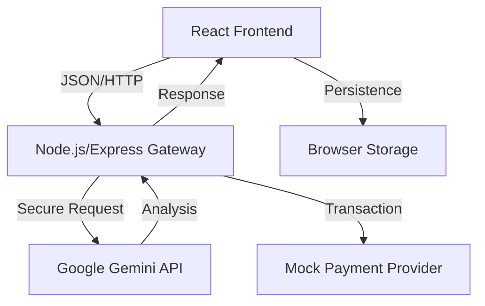

# HabitForge 🚀

HabitForge is an advanced, gamified behavioral modification platform designed to help users build positive routines and break addiction cycles. Built with the MERN architecture and enhanced by Google's Gemini AI, it combines psychological principles with modern web technology to create a sticky, impactful user experience.


## 🌟 Key Features

### 🧠 AI-Powered Behavioral Coaching
*   **Multimodal Food Scanner:** Utilizing Gemini 2.5 Flash, users can snap photos of meals. The system analyzes the visual data to identify food items and estimate caloric density instantly.
*   **Goal Refinement Engine:** A background agent analyzes user log data (30-day history). It detects failure patterns and suggests "Micro-Habits" to lower friction (e.g., converting "Run 5k" to "Put on running shoes").
*   **"Forgey" Chatbot:** A context-aware AI companion that provides motivation based on the user's current level and specific habit list.

### 🛡️ Breaking Bad Habits (Addiction Protocol)
*   **Panic Mode:** A specialized interface for "Bad" habits (e.g., Smoking). Instead of a checkbox, users have a **Panic Button**.
*   **Urge Surfing:** Triggering the Panic Button immediately launches an emergency chat session with the AI, initialized with therapeutic scripts to help the user ride out the craving.
*   **Incident Logging:** Tracks "Days Free" streaks separately from positive repetition streaks.

### 🎮 The Gamification Engine
*   **RPG Mechanics:** Users earn **Willpower Points (WP)** for every action.
*   **Progression:** Visual leveling system with progress bars and unlocked milestones.
*   **Achievements:** Over 15 unique unlockable badges (e.g., "Week Warrior", "Social Butterfly") based on consistency, volume, and social interaction.

### 🤝 Social Connectivity
*   **Shared Accountability:** Invite friends to specific habits via email.
*   **Group Heatmaps:** Visualize collective group consistency on a shared calendar.
*   **Real-time Chat:** Built-in discussion threads for shared habits to foster community support.

## 🏗️ System Architecture

HabitForge follows a **Client-Server-AI** architecture designed for security and scalability.



### Tech Stack
*   **Frontend:** React 19, Vite, TypeScript, Tailwind CSS (Dark Mode enabled).
*   **State Management:** React Context API + Reducer Pattern (Flux architecture).
*   **Backend:** Node.js, Express.js (Acts as a secure BFF - Backend for Frontend).
*   **AI Model:** Google Gemini 2.5 Flash (optimized for low latency multimodal tasks).
*   **Data Export:** CSV generation engine for GDPR compliance/data portability.

## 📂 Project Structure

```text
/habitforge
├── /server                 # Node.js Backend Gateway
│   ├── index.js            # Unified API Endpoint (AI, Payments, Email)
│   └── package.json
├── /src
│   ├── /components         # React UI Components (Widgets, Modals, Views)
│   ├── /context            # Global State Logic (HabitContext, AuthContext)
│   ├── /types              # TypeScript Interfaces & Enums
│   └── App.tsx             # Main Routing & Layout
├── constants.ts            # Gamification Rules & Achievement Definitions
└── metadata.json           # Application Manifest
```

## 🔌 API Documentation

The backend exposes several RESTful endpoints managed via `server/index.js`.

| Method | Endpoint | Description |
| :--- | :--- | :--- |
| `POST` | `/api/scan-food` | Accepts Base64 image; returns JSON nutrition data. |
| `POST` | `/api/refine-goal` | Accepts user history; returns habit modification suggestions. |
| `POST` | `/api/payments/create` | Initiates a secure transaction session. |
| `GET` | `/api/export/csv/:id` | Generates a downloadable CSV of user history. |
| `POST` | `/api/reminders/send` | Dispatches email notifications via SMTP transport. |

## 🚀 Setup & Installation

**Prerequisites:** Node.js v18+

1.  **Clone the Repository**
    ```bash
    git clone https://github.com/yourusername/habitforge.git
    cd habitforge
    ```

2.  **Install Dependencies**
    ```bash
    # Install Frontend Dependencies
    npm install

    # Install Backend Dependencies
    cd server
    npm install
    cd ..
    ```

3.  **Environment Configuration**
    Create a `.env` file in the `/server` directory with your credentials:
    ```env
    PORT=5000
    API_KEY=your_google_gemini_api_key
    ```

4.  **Launch Application**
    *   **Backend:** `cd server && npm start` (Runs on port 5000)
    *   **Frontend:** `npm run dev` (Runs on port 5173)

## 🔮 Future Scope

*   **PWA Support:** Implementation of Service Workers for offline logging.
*   **Database Migration:** Transition from LocalStorage to MongoDB Atlas for cross-device synchronization.
*   **Wearable Integration:** API hooks for Apple Health/Google Fit to auto-complete fitness habits.

---
© 2025 HabitForge. Designed & Engineered by [Your Name].